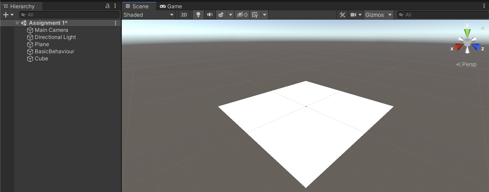
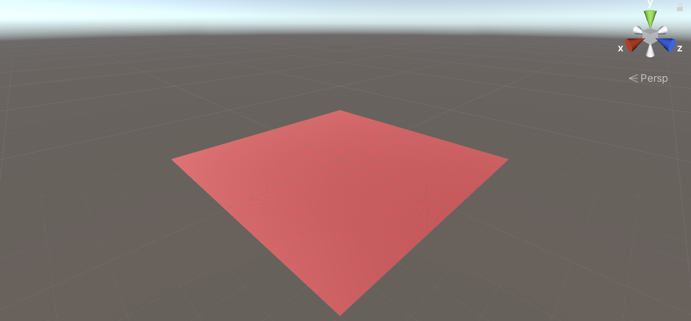
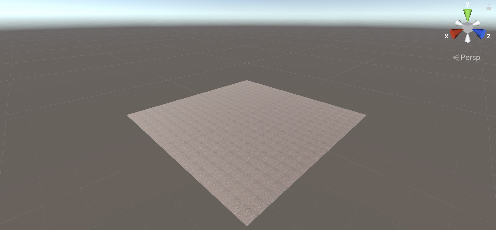
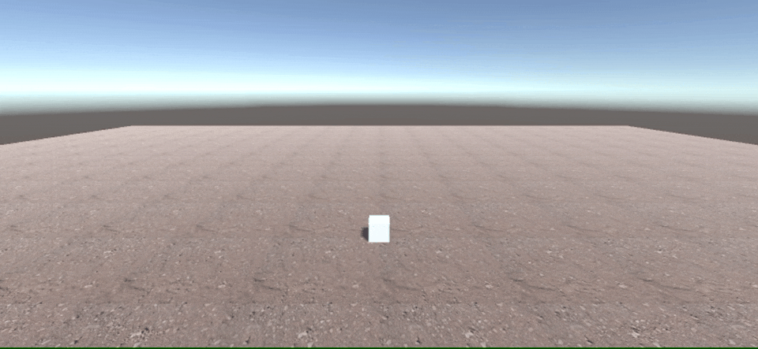
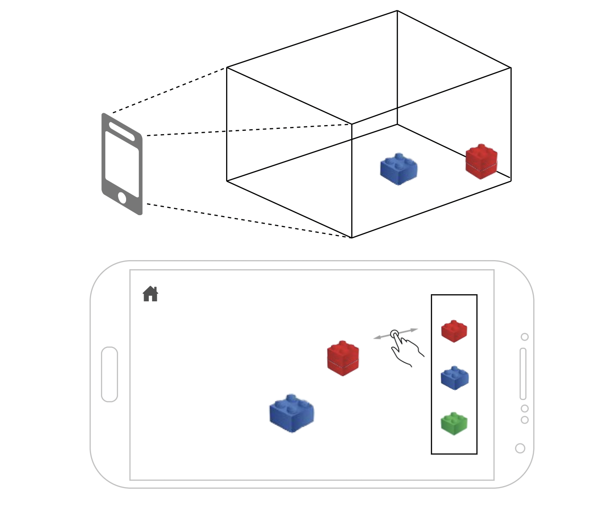

# Assignment 1 - Unity basics (ungraded)

**Date**: [TODO: date]

**Group members participating**: Rasmus Thorsøe and Sam Martin Vargas Giagnocavo (Luis?).

**Activity duration**: [TODO: Insert hours spend]

## Goal
- Understand some of Unity's basic functionality (such as inserting objects, scripting, interaction and colliders).
- Build a large portion of what can become our AR application.

## Plan
To have a better undestanding of how Unity works we decided not to split the workload for this assignment. Each member would have to do the exercises and once finished we would start writing the report.

## Results

### <ins>Exercise 1</ins>
Should we even bother completing this?
### <ins>Exercise 2</ins>
Should we even bother completing this?
### <ins>Exercise 3.1</ins>
The first step was creating a new scene called *Assignment 1*. This was done by selecting *File → New Scene* in the menu bar.

Once the scene was created we added a 3D plane and a 3D Cube to the scene. This could be done by clicking on the *+* button located in the Hierarchy pane. An empty GameObject called *BasicBehaviour* was also added. Unity's preview view now displays the following:


Next, we created a cube prefab (inside the Prefabs folder) from the 3D Cube we previously inserted in the scene.

Finally, we created the `ObjectAdder.cs` script that would display a *Hello World* message and place a cube prefab on top of the plane. Since the prefab had to be instantiated, a *SerializeField* was added so that we could point the cube prefab to the script.
```c#
using System.Collections;
using System.Collections.Generic;
using UnityEngine;

public class ObjectAdder : MonoBehaviour
{

    [SerializeField]
    public Transform prefab;

    void Start()
    {
        float planeY;
        GameObject plane;
        Vector3 cubeSize, cubePos, planePos;
        
        // A crappy Unity script is born...
        Debug.Log("Hello, World");

        // Retrieve the plane from the scene
        plane = GameObject.Find("Plane");
        // Get the plane's Y value
        planeY = plane.GetComponent<Collider>().bounds.size.y;
        // Get the plane's position
        planePos = plane.transform.position;
        // Get the prefab's size
        cubeSize = prefab.Find("Cube").GetComponent<MeshRenderer>().bounds.size;
        
        // The cube is on top of the plane now...
        cubePos = new Vector3(0, planeY, 0);
        // But we still need to add an offset (half of the cube's Y value)
        cubePos += new Vector3(0, cubeSize.y / 2, 0);
        
        // We create the prefab :D
        Instantiate(prefab, cubePos, Quaternion.identity);
    }

    void Update() {}
}
```

To properly position the prefab on top of the plane (without cutting through it), an offset had to be added in the `Instantiate` function. **We later found out that this is not ideal way of doing it**. If we were to use an empty *GameObject* as a parent for our cube and apply the offset there, we would not need to modify the code at all.

INSERT EXAMPLE WITH PARENT OBJECT

### <ins>Exercise 3.2</ins>
For this exercise we created a simple material (Ground) inside of the *Materials* folder in our project.

Initially we assigned the material a red color by changing the *Albedo* value in the inspector pane. After that we assigned it to the plane. This was the result:


Once that was done, we searched for a texture to add to our new material. We created a *Textures* folder and saved a dirt texture in it. After that we dragged the image to the *Albedo* value in the inspector view of our new material. The tiling in the material was slightly modified to make it look better. An example of the plane using a dirt texture can be seen below.

### <ins>Exercise 3.3</ins>
### <ins>Exercise 3.4</ins>
With the `MoveAround.cs` script created from the Project pane, we add the following line at the end of the *Start* function in `ObjectAdder.cs`.
```c#
GameObject.Find("Cube").AddComponent<MoveAround>();
```
Once we have checked that the script does indeed load alongside the cube. We modify the script to make the cube move around.

```c#
void Update()
{
    float x, y, z;
    x = transform.rotation.x;
    y = transform.rotation.y;
    z = transform.rotation.z;
    if (Input.GetKey(KeyCode.W))
    {
        transform.position += new Vector3(0, 0, 0.1f);
    }
    else if (Input.GetKey(KeyCode.A))
    {
        transform.position -= new Vector3(0.1f, 0, 0);
    }
    else if (Input.GetKey(KeyCode.S))
    {
        transform.position -= new Vector3(0, 0, 0.1f);
    }
    else if (Input.GetKey(KeyCode.D))
    {
        transform.position += new Vector3(0.1f, 0, 0);
    }
    else if (Input.GetKey(KeyCode.Q))
    {
        transform.RotateAround(transform.position, -transform.up, Time.deltaTime * 90f);
    }
    else if (Input.GetKey(KeyCode.E))
    {
        transform.RotateAround(transform.position, transform.up, Time.deltaTime * 90f);
    }
}
```

The GIF below shows a small example of the cube's movement.


### <ins>Exercise 3.5</ins>
### <ins>Exercise 3.6</ins>
### <ins>Exercise 3.7</ins>
Fortunately "cleaning up" the project was not needed since we followed the suggestions that were given to us at the beginning of the TA session. Our folder structure is as follows:


However, we did have to modify the code so that new objects would be added to an empty parent object. This was achieved by creating a *GameObject* inside of `ObjectAdder.cs`, initializing it and using its transform value to instantiate the new objects. A simplified version of the code can be seen below.
```c#
using System.Collections;
using System.Collections.Generic;
using UnityEngine;

public class ObjectAdder : MonoBehaviour
{

    // Variables...
    
    private GameObject parent;

    void Start()
    {
        // Variables...
        
        // Create empty parent
        parent = new GameObject("Generated Objects");

        // More code...
        
        Instantiate(prefab, cubePos, Quaternion.identity, parent.transform);
        
        // More code...
    }

    // Update is called once per frame
    void Update()
    {
        // More code...
        
        if (Input.GetKeyDown(KeyCode.K)) {
            Instantiate(midairPrefab, midairPos, Quaternion.identity, parent.transform);
        } else if (Input.GetKeyDown(KeyCode.Mouse0)) {
            // More code...
        }
    }
}
```
### <ins>Exercise 4.1</ins>
Our initial idea for the upcoming assignments consists of an application that would let the user build blocks and other structures in the "real world" (an AR LEGO®).

The user would use his phone as a viewport to a canvas (which in this case would be his surroundings). From the device the user would be able to select different types of blocks and drag them to different positions.

In the following image we can see the main view of the application.


## Conclusion
Throughout this assignment we have learned the basics for creating a small and simple 3D application in Unity. From user input to object creation, all of these concepts will be necessary for developing an AR application in the upcoming assignments.

Finally, during this assignment we have started considering several ideas and themes for the application, settling for now for a simple AR building app.

## References
- [Unity Docs](https://docs.unity3d.com/Manual/index.html)
