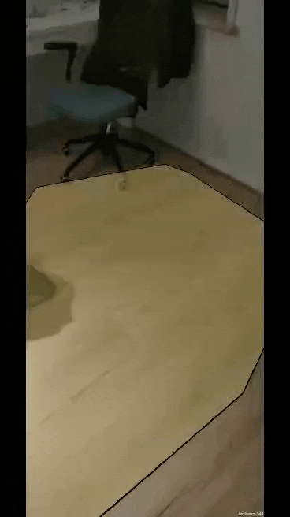

# Assignment 2 - AR Foundation basics (ungraded)

**Date**: [TODO: date]

**Group members participating**: Rasmus Thorsøe, Sam Martin Vargas Giagnocavo

**Activity duration**: [TODO: Insert hours spend]

## Goal
[TODO: goal of this weeks exercises]

## Plan
Similar to what was proposed for the last assignment we decided not to split the workload for this assignment to have a better undestanding of how Unity works. Each member would have to do the exercises and once finished we would start writing the report. 

## Results

### <ins>Exercise 2.1</ins>

## Conclusion
[TODO: conclusions of this weeks exercises]

## References
- [Unity Docs](https://docs.unity3d.com/Manual/index.html)