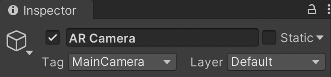
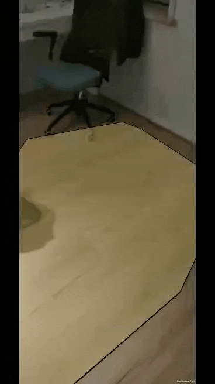
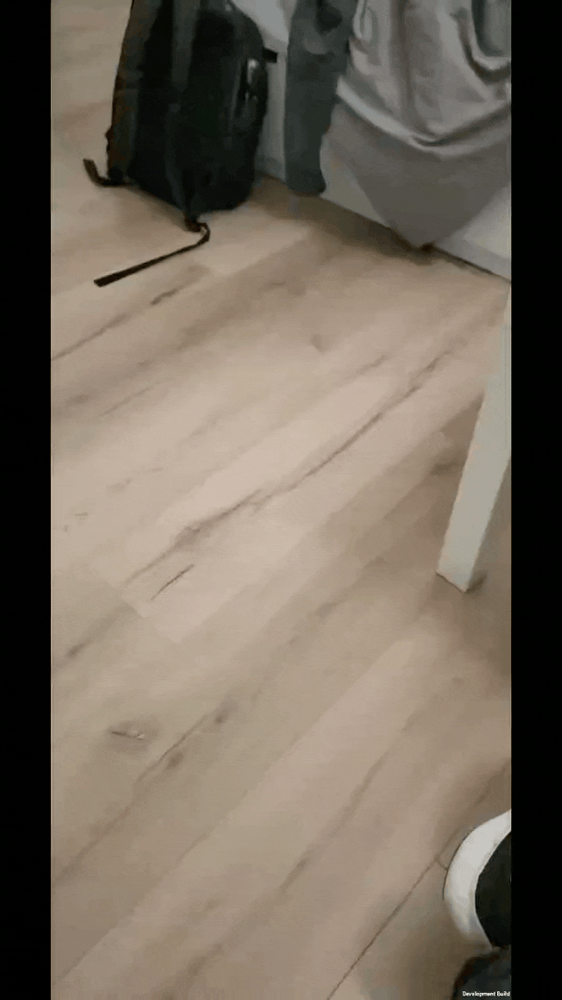
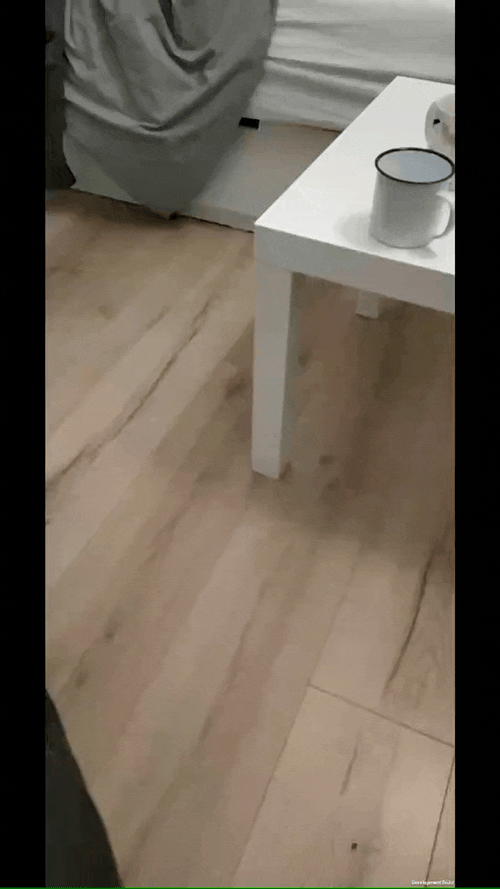
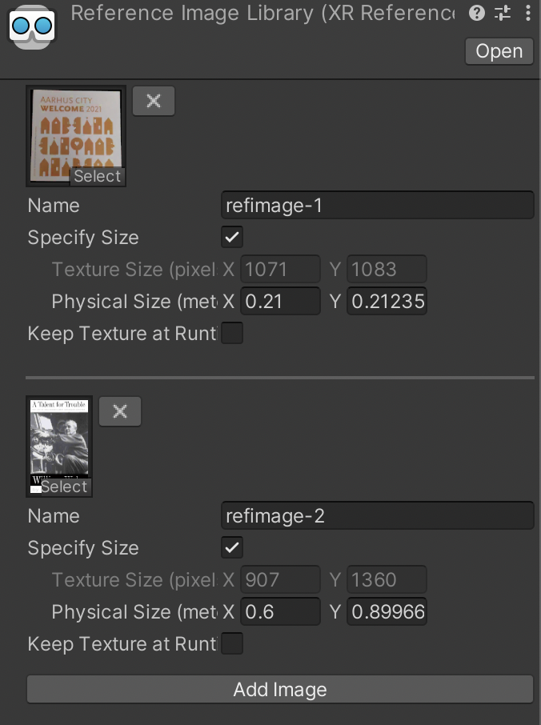

# Assignment 2 - AR Foundation basics (ungraded)

**Date**: 11/02/2022

**Group members participating**: Rasmus Thorsøe, Sam Martin Vargas Giagnocavo and Nishka Dasgupta.

**Activity duration**: 7 to 8 hours.

## Goal
- Begin building a phone app.
- Learn basic Unity functionality such as scene creation, plane detection, object tracking.
- Create a mobile app that can add an object tethered to a plane in the physical world.

## Plan
As in the previous week, we initially decided that each member should work on all exercises independently. So over the course of the week we each worked independently on the remaining exercises and made different degrees of progress. On Friday we decided to split the remaining coding work between Sam and Rasmus, with Nishka and Sam working on the report.

## Results
Exercise 1 was completed by all of us in the TA session... And we did make sure that our camera was tagged as *MainCamera*:



### <ins>Exercise 1.2</ins>
After building the application as a phone app, it shows approximate planes being tracked in the physical world, e.g a bed or a windowsill. In low light conditions it does not do well with planes that are close to the camera, e.g the laptop keyboard a few inches away. On occasion the application will appear to track planes where none exist, e.g in mid-air.

### <ins>Exercise 2.1</ins>
For this exercise we created a cube object with the given parameters (side length 0.2, rigidbody with gravity enabled). We then made it a prefab and deleted the object.

To retrieve the camera that we use in the scene we used `Camera camera = Camera.main` as opossed to what we did in the previous assignment which was select our camera from a `[SerializeField]`.

The cube object appears to have sides of length slightly less than 30 cm, when compared against various objects in the physical world, both near and far from the camera. As the side of the cube prefab was set to 0.2 units in unity, we can assume that 1 unit in unity corresponds to a little over 1 metre in the physical world.

Two implementations were made when positioning the cubes. In the first one, no offset is added to the cubes position, so when we enter a cube at the same position as an existing cube, the cubes explosively repel each other and are flung to different corners of the space.

The second, added a small offset to the cubes Y-axis. In this case, the cubes collide as seen in the GIF below.




### <ins>Exercise 2.2</ins>
Once we have deleted the `AR Default Plane` that was previously added, we implemnented AR Foundations' raycast function. Similar to what we did in the previous assignment, we placed a conditional inside the `Update` function that would register the user's touch and check whether there was an invisible AR plane in the way.

```c#
[SerializeField]
ARRaycastManager raycastManager;

// Code...

void Update()
{
    
    Ray ray;
    List<ARRaycastHit> hits = new List<ARRaycastHit>();
    
    // placePos = get position that was touched...
    
    ray = camera.ScreenPointToRay(placePos);

    if (raycastManager.Raycast(placePos, hits)) {
        raycastPos = ray.GetPoint(hits[0].distance);
        
        // Magic...
    }

}
```

Using the library's raycast function we observe that now new objects do appear, but they fall through the ground. This is due to the objects having gravity enabled and not being another object (with a collider) to stop them from falling (that was the function of the `AR Default Plane`). An example of the cubes endlessly falling can be seen below.



To fix this we remove gravity from the prefab's *Rigidbody*. This is the result: 



Since the exercise did not specify whether the object's *Collider* had to be removed or not, we decided not to remove it. That's why the objects repel each other when positioned in the same coodinates.

The Unity built-in raycast function tracks objects in the physical world, whereas AR Foundation's raycast tracks trackable AR objects that may not exist in the physical world.

### <ins>Exercise 2.3</ins>
Once a texture for the indication marker was found, we added it to the textures folder.

To display the marker every time AR Foundation detects a surface, we trigger a ray for each update. With `ViewportToScreenPoint` we get the position of the center of the screen. We then use that position for the `Raycast` function from `ARRaycastManager`.

```c#
void Update()
{
    
    Ray ray;
    List<ARRaycastHit> hits = new List<ARRaycastHit>();
    
    // SHOULD WE POSITION THE PLACEHOLDER ?
    placePos = camera.ViewportToScreenPoint(new Vector3(0.5f, 0.5f, 0));
    ray = camera.ScreenPointToRay(placePos);

    if (raycastManager.Raycast(placePos, hits)) {
        raycastPos = ray.GetPoint(hits[0].distance);
        if (activePlaceholder) {
            activePlaceholder.transform.position = raycastPos;
        } else {
            activePlaceholder = Instantiate(placeholder, raycastPos, Quaternion.identity);
        }
    } else if (activePlaceholder) {
        Destroy(activePlaceholder);
    }

}
```

Since the indication marker has to be tied to the center of the screen we change it's position if the object has already been instantiated (we track this with the `activePlaceholder` variable). An example of this behaviour can be seen below.


### <ins>Exercise 2.4</ins>
We added a UI Button, and positioned it in the bottom of the screen using the button anchor. To make the button do something, we need to drag the appropriate object (containing the script we want to use) into the inspector pane of the button, and select the appropriate function to call. The function must be public. 

This is what it looks like (after fiddling a bit with the button's position).


We decided that the indication marker should only be visible while the user is actively placing an item i.e. After they have pressed the button. After the user has placed the item, the indication marker disappears again. 

### <ins>Exercise 2.5</ins>
Since our group hasn't settled for an idea yet, we decided to choose a [random 3D model from the Unity Store](https://assetstore.unity.com/packages/3d/props/bowling-kegel-ball-67371). For the example we will use the AR raycast function since the pins will be placed on top of the "real" floor.

An example can be seen below:


### <ins>Exercise 3.1</ins>
Now, our goal is to track predefined images. To achieve that we create a library of target images, a `ReferenceImageLibrary`. For this example we have chosen to take photos of two objects (a book and a brochure) that had enough keypoints to be considered good refence images.

<p float="left">
   
  
</p>

After that, we add an AR Tracked Image Manager component to our AR Session Origin object (just like we did for our AR Raycast Manager) and specify the collection of images we just created.

To not make our original script too long, a new script was created, `TrackedObject.cs`. Here we will subscribe to the `trackedImagesChanged` event:

```c#
void Start()
{
    trackedImageManager.trackedImagesChanged += OnChanged;
}

void OnChanged(ARTrackedImagesChangedEventArgs eventArgs)
{
    foreach (var newImage in eventArgs.added)
    {
        // We want to add as a child so we use newImage.transform
        Instantiate(prefab, new Vector3(0, 0, 0), Quaternion.identity, newImage.transform);
    }

    // More code...
}
```

This will create a meaningful object as soon as it detects an image from our library. The object is tied to the predefined image; so if the image were to be moved, the object would move too. 

### <ins>Exercise 3.2</ins>
For the test, we decided to change the scale of the book and keep the original size of the brochure. This was done in the inspector pane when selecting the Reference Image Library.



The end result can be seen here:


Due to the book being registered as twice the size as it really is, Unity thinks the book is further than it really is. That is why the meaningful object appears smaller when compared to the one displayed on top of the brochure.

## Conclusion
During this assignment we learned the basics of mixing the virtual world with the physical world in Unity. These concepts will be vital to our final project.

We also further refined our final project idea.

## References
- [Unity Docs](https://docs.unity3d.com/Manual/index.html)
