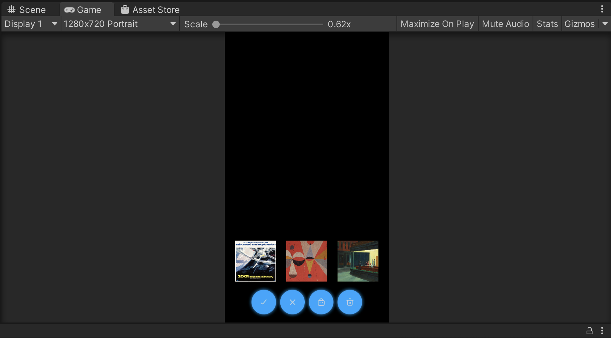
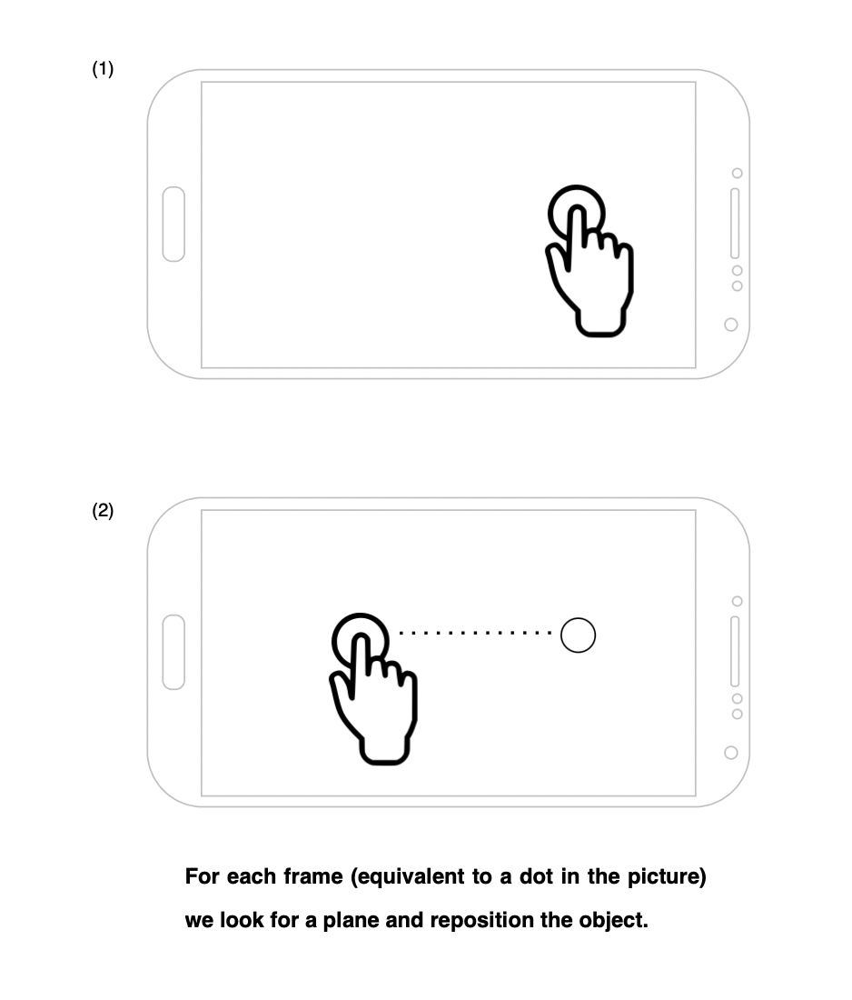
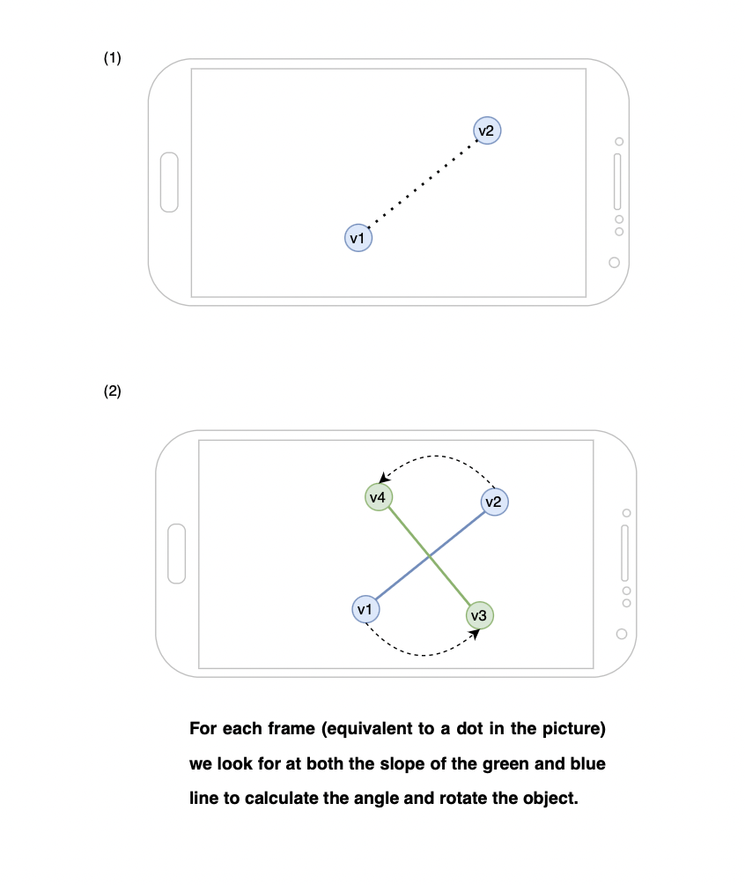

# Assignment 3 - Starting on your app (graded)

**Date**: 20/02/2022

**Group members participating**: Rasmus Thorsøe, Sam Martin Vargas Giagnocavo and Nishka Dasgupta.

**Activity duration**: 7-8 hours

## Goal
- Start creating our own AR app
- Be able to add, and remove objects
- Be able to move and rotate objects

## Plan
The plan was for Nishka to do exercise 1, creating the intial scene, indication marker, "delete all" button etc. Then for Rasmus to do exercise 2, 
adding selection capabilities with highlighting, as well as the ability to individually delete items. Exercise 3 was planned to be done by Nishka and 
Sam in cooperation, adding the ability to move and rotate objects. The plan was created like this due to the tasks being very dependent on each other, 
and needing to fit that into our individual time constraints.  

## Results
### <ins>Exercise 1</ins>
We created a new scene, Assignment 3, and implemented active plane tracking, indication markers, and a button to add new objects. As our project 
will involve placing posters/stickers on vertical surfaces, we changed our plane tracking to track only vertical planes. While this causes some 
difficulties for walls that are wholly plain (due to a lack of features for Unity to detect), it does work well on other vertical planes, such as 
doors and open laptops. We expect it to also work on walls that are not a uniform colour, e.g walls that already have at least one poster already.

Our indication marker is the same as in the previous assignment. We now have a catalogue of 3 objects (2D art). These are all displayed in a row at all times. On clicking an object, the check mark button lights up, enabling the user to place the object wherever the indication marker is. The way we handle this is by using a *Toggle Group*.

A dustbin button enables deletion of all objects in the scene. This was implemented using Unity tags, and deleting GameObjects with the relevant tag. In this case we use the "poster" tag, which is assigned to each object that is created within the script.

A screenshot of the UI can be seen below:



### <ins>Exercise 2</ins>
For this exercise we started with a bit of a refactoring, this made it easier to handle what is effectively 2 different states of our application: The "adding" state and the "interact" state. To model this we split up the intended functionality into 3 parts: The "State" class would be responsible for knowing which state we are in, and enabling/disabling the other 2 classes based on the state. The "RealObjectAdder" class would be responsible for the "adding" state and the "RealObjectInteracter" class would be responsible for the "interact" state (e.g showing deletion button when an object is selected).

The default state is the "interact" state, if the "Add object" button is clicked, the "adding" state will be entered. 

In the "interact" state, when a user presses an object the object is selected and highlighted in yellow. The highlighting is done using a yellow plane, which is added as a child to the object. The yellow plane is then scaled to be slightly bigger than the object and slightly behind it. The user can deselect the object by pressing it again, or by selecting another object. 


To let the user delete the selected object, we SetActive(true) on the "Delete" button whenever the user has selected an object. When the user deselects or deletes the object, we SetActive(false) on "Delete" button. 

### <ins>Exercise 3</ins>
For this exercise we enable translational and rotational motion of the object. We enable translation when the user selects an object and uses one finger to drag it across the screen. This does not affect any other virtual objects that the selected object is very close to. At all times we check for the existence of a (vertical) plane before moving. 



```c#
// One finger touches the screen. Is the user selecting, deselecting or moving?
if (touches.Length == 1 && touches[0].phase == TouchPhase.Began) {
    this.hasMoved = false;
    this.lastTwoFingerPosition = null;
    
    ray = Camera.main.ScreenPointToRay(touches[0].position);

    // Is the finger pointing at something?
    if (Physics.Raycast(ray, out hit)) {
        // We have selected the same object.
        // Are we deselecting or moving the object?
        if (this.selectedObject == hit.transform.gameObject) {
            this.checkForMovement = true;
        // We have selected a different object,
        // no need to check for movement.
        } else {
            this.checkForMovement = false;
            SelectObject(hit.transform.gameObject);
        }
    } 

}

// If the user pointed at an already selected object, check for movement and move the object.
if (touches.Length == 1 && this.checkForMovement && touches[0].phase == TouchPhase.Moved && this.selectedObject) {
    this.hasMoved = true;
    List<ARRaycastHit> hits = new List<ARRaycastHit>();
    if (raycastManager.Raycast(touches[0].position, hits)) {
        if (hits[0].trackable is ARPlane) {
            this.selectedObject.transform.position = hits[0].pose.position;
            this.selectedObject.transform.rotation = hits[0].pose.rotation;
        }
    }
}

// If the user has stopped touching the screen and we were unsure whether he was deselecting
// an object or moving an object, make a decision based on whether he moved his finger.        
if (touches.Length == 1 && this.checkForMovement && touches[0].phase == TouchPhase.Ended) {
    // Move object
    if (!this.hasMoved) {
        SelectObject(null);
    }
    
    this.lastTwoFingerPosition = null;
    this.checkForMovement = this.hasMoved = false;
}
```

If, after selection, the user is touching the screen with multiple fingers, we assume the user wishes to rotate the object. For this, we track the starting and ending positions of both fingers (v1 and v2 for the starting position, and v3 and v4 for the end position). We use the difference between the slopes of the line for these two pairs of positions to compute the angle by which we must rotate the object.




```c#
// Check for rotation if an object is selected.
if (touches.Length == 2 && touches[0].phase == TouchPhase.Moved && touches[1].phase == TouchPhase.Moved && this.selectedObject) {
    
    currTwoFingerPosition = new Vector2[] {touches[0].position, touches[1].position};
    
    // We compare the current generated line with
    // the previous registered one.
    if (this.lastTwoFingerPosition != null) {
        
        float slope_1 = CalcSlope(this.lastTwoFingerPosition[0], this.lastTwoFingerPosition[1]);
        float slope_2 = CalcSlope(currTwoFingerPosition[0], currTwoFingerPosition[1]);
        
        float angle = (slope_2 - slope_1) / (1 + slope_1 * slope_2);            
        float inv = (float) Math.Atan(angle);
        float degrees = (float) ((inv * 180) / Math.PI);

        this.selectedObject.transform.Rotate(0.0f, -1.0f * degrees, 0.0f, Space.Self);
    }

    this.lastTwoFingerPosition = currTwoFingerPosition;
}
```

A demonstration of what was previously explained can be seen below.


## Conclusion
During this week's exercises we learned how to manipulate specific objects. We learned that, for vertical surfaces, the indication marker changes its dimensions depending on the angle. 

We finalised our final project idea as an art-based app, where the user can arrange posters on their wall or stickers on their laptops.

## References
- [Unity Docs](https://docs.unity3d.com/Manual/index.html)
