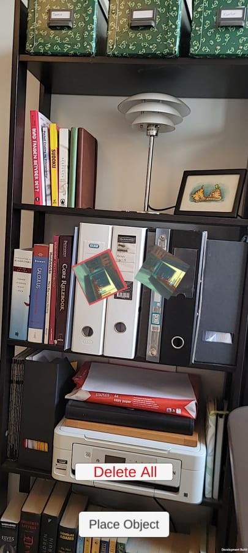

# Assignment 3 - Starting on your app (graded)

**Date**: [TODO: date]

**Group members participating**: Rasmus Thorsøe, Sam Martin Vargas Giagnocavo and Nishka Dasgupta.

**Activity duration**: [TODO: Insert hours spend]

## Goal
- Start creating our own AR app
- Be able to add, and remove objects
- Be able to move and rotate objects

## Plan
The plan was for Nishka to do exercise 1, creating the intial scene, indication marker, "delete all" button etc. Then for Rasmus to do exercise 2, adding selection capabilities with highlighting, as well as the ability to individually delete items. Exercise 3 was planned to be done by Nishka and Sam in cooperation, adding the ability to move and rotate objects. The plan was created like this due to the tasks being very dependent on eachother, and needing to fit that into our individual time constraints.  

## Results

### <ins>Exercise 2.1</ins>
For this exercise we started with a bit of a refactoring, this makes it easier to handle was is effectively 2 different states of our application: The "adding" state and the "interact" state. To model this we split up the intended functionality into 3 parts: The "State" class would be responsible for knowing which state we are in, and enabling/disabling the other 2 classes based on the state. The "RealObjectAdder" class would be responsible for the "adding" state and the "RealObjectInteracter" class would be responsible for the "interact" state. 

The default state is the "interact" state, if the "Add object" button is clicked, the "adding" state will be entered. 

In the "interact" state, when a user presses an object, the object is highlighted in red. This is done using a red plane, which is added as a child to the object. The red plane is then scaled to be slightly bigger than the object and slightly behind the object. 

## Conclusion
[TODO: conclusions of this weeks exercises]

## References
[TODO: used references]
