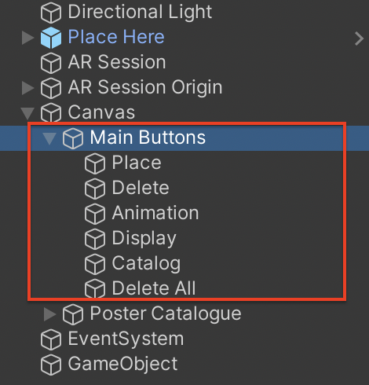
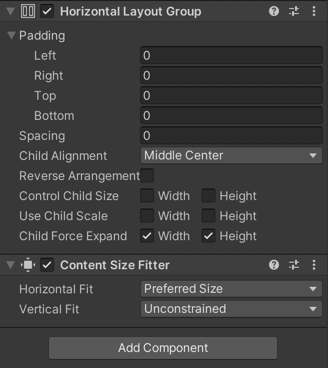
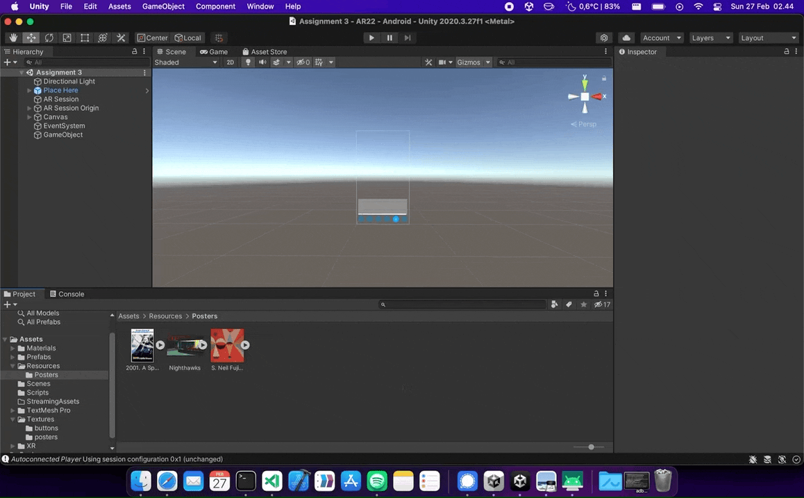

# Assignment 4 - Interaction techniques (graded)

**Date**: 20/02/2022

**Group members participating**: Rasmus Thorsøe, Sam Martin Vargas Giagnocavo and Nishka Dasgupta.

**Activity duration**: 7-8 hours

## Goal
- Further develop our AR app.
- Enable an expanded selection of objects for users to choose from.
- Enable customisation and animation of objects.

## Plan
The plan was for Sam to work on Exercise 1 (designing the catalogue for our posters), and for Nishka and Rasmus to do Exercises 2.1 (animation) and 2.2 (customisation)
respectively. For the catalogue we planned to keep it in its previous position (a horizontal bar near the bottom of the screen), accessible via a 
button with a shopping bag logo on it. For animation, we decided to have blinking text displaying the name of the selected poster. For customisation
we decided to let the user select if they wanted the texture of the poster to be matte or glossy.

## Results


### <ins>Exercise 1</ins>
In this exercise we had to tackle two problems: Easily increase the number of items in our catalogue without major changes in our code and making the UI usable regardless of the resolution or orientation of the device. While in the last assignment we already tackled the latter challenge by using anchors we would like to have the possibility of adding more items in our UI. To achieve this, we decided to put all of our buttons in a parent called "Main Buttons". This object would include a "Horizontal Layout Group" and a "Content Size Filter" to spread the buttons evenly and change their size if required.

<p float="left">


</p>

Finally, we had to find a way of dinamically managing a catalogue within our application. In order to implement this, we decided to expand our implementation of the poster selection panel by adding a `Scroll View` object (which we call *Poster Catalogue*) to our canvas. Just like in the "Main Buttons" object, we added a "Horizontal Layout Group" and a "Content Size Filter" to the content of the `Scroll View`. Adittionally, a script called `Catalogue.cs` was also added to the content. Since our app consists of displaying posters, we don't work with 3D models but 2D textures. Consequently, the function of our catalogue script is to retrieve all of the 2D Textures available (this is done with `Resources.LoadAll`) and create their respective buttons (from a prefab) and materials.

```c#
void Start()
{
    // We are creating materials from the 2D Textures.
    materials = new List<Material>();
    // Load all Sprites from the Resources/Posters folder
    Sprite[] sprites = Resources.LoadAll<Sprite>("Posters");
    for (int x = 0; x < sprites.Length; x++) {
        // Create toggle button
        GameObject go = Instantiate(togglePosterPrefab, this.transform);
        go.SetActive(true);
        
        // Create material from 2D Texture / Sprite
        Material mat = new Material(Shader.Find("Standard"));
        mat.SetTexture("_MainTex", sprites[x].texture);
        materials.Add(mat);
        
        // Add toggle button to Toggle Group
        Toggle to = go.GetComponent<Toggle>(); 
        to.group = toggleGroup;
        
        // Add relevant listener functions
        int assignedIndex = x;
        to.onValueChanged.AddListener(delegate {
            realObjAdder.ChangeCurrentMaterial(materials[assignedIndex]);
            realObjAdder.ChangeCurrentName(sprites[assignedIndex].name);
        });

        // Add 2D Texture / Sprite to toggle button
        Image img = go.GetComponentInChildren<Image>();
        img.sprite = sprites[x];
    }
}
```

A demostration of the new layout can be seen below (at the beginning we can see the original 2D Textures being used, which are then turned into buttons and materials):


### <ins>Exercise 2.1</ins>
For the animation we decided to go with blinking text displaying the name of the artwork that the user has placed from the catalogue. The name of the artwork is 
a 3DText object created as the child of each artwork. We then use a timer to periodically enable and disable it for as long as the toggle for animation is on. The code for the animation can be seen here: 

```c#
void Update()
    {
	    if(animated) {
			timer = timer + Time.deltaTime;
			if(timer >= 0.5) {
				this.transform.GetChild(0).gameObject.SetActive(true);
			}
			if(timer >= 1) {
				this.transform.GetChild(0).gameObject.SetActive(false);
				timer = 0;
			}
		}
		else {
		    this.transform.GetChild(0).gameObject.SetActive(false);
		}
	}
```

The script is attached to any piece of artwork the user has placed in the world. The "animated" boolean is toggled on and off when the corresponding button is clicked. 
The animation can be seen in the following video: 

INSERT VIDEO OF ANIMATION

### <ins>Exercise 2.2</ins>
For customisation we decided to let the user choose real-world texture of the object, i.e, should the artwork be matte or glossy. The code can be seen here: 
```c#
public void toggleGlossy()
    {
        Material mat = this.selectedObject.GetComponent<Renderer>().material;
        float currentGlossiness = mat.GetFloat("_Glossiness");

        if (currentGlossiness == 0.0)
        {
            mat.SetFloat("_Glossiness", 1);
            mat.SetFloat("_Metallic", 1);
        }
        else
        {
            mat.SetFloat("_Glossiness", 0);
            mat.SetFloat("_Metallic", 0);
        } 
    }
```

Here you can see the effect in the app, the poster on the left is maximum metallic/glossy, and the poster on the right is minimum metallic glossy. 
The effect is not quite what we had hoped for, and is not what we would expect to see in real life. This is probably due to our AR app not properly understanding the lighting in the real world, as the appearance of glossy/metallic surfaces are very dependent on the exact location, intensity and colour of light. 

INSERT VIDEO

## Conclusion
During this weeks exercises we have learned how to arrange the UI such that it works regardless of the users phone orientation.
We have created more interesting objects, and learned how to toggle states on and off for individual objects, and how to do simple animations in unity. 
We have also learned that the use of light (or materials that require light) in AR applications is not trivial. 

## References
- [Unity Docs](https://docs.unity3d.com/Manual/index.html)
